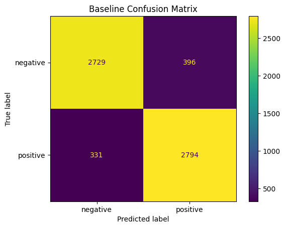
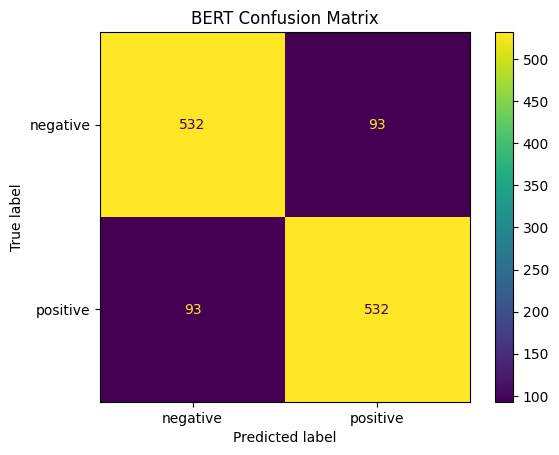
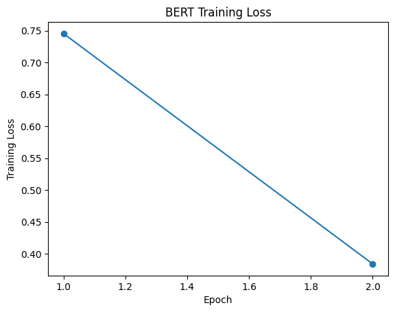
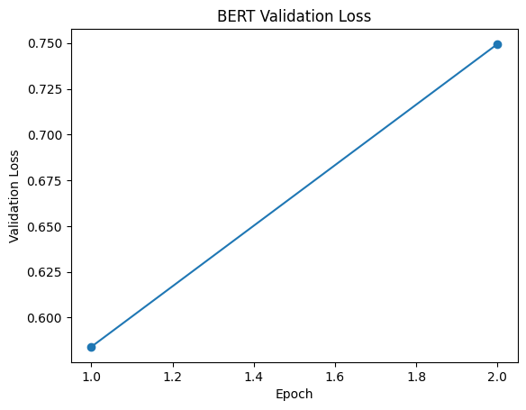
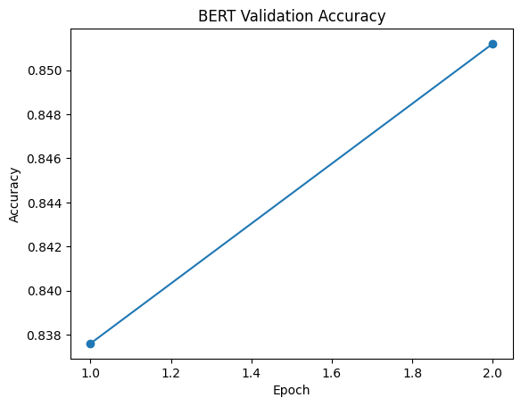
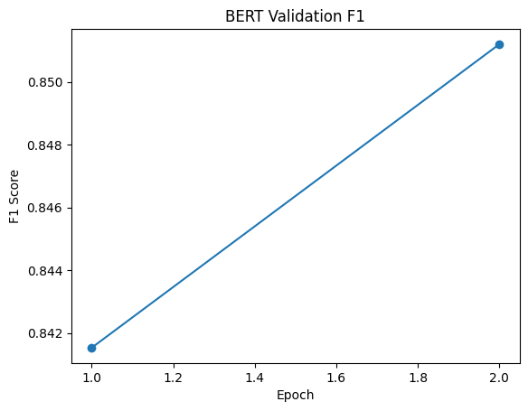

# End-to-End NLP Pipeline for Customer Feedback Analysis

**Bhavana Chikkamuduvadi Renuka Gowda**
Data Scientist | Machine Learning | NLP

---

## Overview

Designed and evaluated an end-to-end NLP sentiment analysis system using the IMDb dataset, benchmarking classical machine learning against transformer-based models to understand performance trade-offs in real-world text classification.

This system demonstrates how businesses can automate large-scale customer feedback analysis to identify sentiment trends, detect dissatisfaction early, and support product and customer experience decisions.

---

## Dataset

* Source: IMDb movie reviews dataset
* Total size: 25,000 labeled samples
* Training subset: 5,000 balanced samples (2,500 positive, 2,500 negative)

---

## Pipeline

1. Text preprocessing (cleaning, normalization)
2. Baseline model:

   * TF-IDF vectorization
   * Logistic Regression classifier
3. Transformer model:

   * DistilBERT fine-tuning using Hugging Face Transformers
4. Evaluation:

   * Accuracy
   * F1 Score
   * Confusion Matrix
   * Training & Validation Curves
5. Inference on unseen text inputs

---

## Results

### Baseline (TF-IDF + Logistic Regression)

* Accuracy: **88.37%**
* F1 Score: **0.8849**

### DistilBERT

* Accuracy: **85.12%**
* F1 Score: **0.8512**

---

## Model Performance Visualizations

### Baseline Confusion Matrix



### DistilBERT Confusion Matrix



### Training and Validation Curves






---

## Key Observations

* The baseline model outperformed DistilBERT in this experiment, achieving higher accuracy and F1 score.
* DistilBERT showed consistent learning (training loss decreased significantly), but validation loss increased slightly, indicating mild overfitting.
* Balanced sampling improved prediction stability across both classes.
* Results highlight that classical models remain highly competitive for sentiment classification tasks, especially under limited training budgets.

---

## Why the Baseline Outperformed DistilBERT

In this experiment, the TF-IDF + Logistic Regression baseline outperformed DistilBERT. This is likely due to several factors:

* TF-IDF features are highly effective for sentiment classification tasks where polarity is strongly associated with specific words and phrases.
* The transformer model was trained on a relatively small local subset (5,000 samples), which may not be enough to fully leverage its contextual modeling power.
* Classical linear models often perform surprisingly well on clean, well-structured text classification tasks, while requiring less computation and tuning.

This result highlights an important machine learning lesson: more complex models do not always outperform simpler approaches, especially under constrained training setups.

---

## Error Analysis

The model performed well on clearly positive and clearly negative reviews, but there are still likely failure cases:

* Reviews with mixed sentiment (both praise and criticism)
* Neutral or ambiguous phrasing
* Sarcasm and implicit sentiment
* Domain-specific expressions not strongly represented in the sampled dataset

This suggests that while the current model is effective for general sentiment detection, further improvements could come from training on a larger dataset and performing deeper error analysis.

---

## Sample Inference

* "The product is amazing and works perfectly." → Positive
* "The experience was okay, nothing special." → Negative
* "Very disappointed with the service and quality." → Negative

---

## Project Structure

```
data/
models/
results/
  ├── baseline_metrics.json
  ├── bert_metrics.json
  ├── plots/
src/
```


---

## Tech Stack

* Python
* Pandas
* Scikit-learn
* Hugging Face Transformers
* PyTorch
* Matplotlib

---

## Deployment Considerations

This project was developed as a local experimental pipeline, but it can be extended toward production use cases:

* Batch inference for large-scale customer feedback processing
* Real-time inference via API endpoints
* Model monitoring for performance drift
* Model versioning for reproducibility
* Cloud deployment for scalability

---

## Future Improvements

* Hyperparameter tuning for DistilBERT
* Early stopping to prevent overfitting
* Training on the full dataset instead of a subset
* Deeper error analysis on misclassified samples
* Model calibration to reduce overconfidence
* Deployment as a REST API or batch scoring system

---

## Summary

This project demonstrates a complete applied machine learning workflow, including model benchmarking, evaluation, and interpretation. It highlights practical trade-offs between classical ML and transformer-based approaches, reinforcing that model effectiveness depends on context, data size, and computational constraints—not just model complexity.
